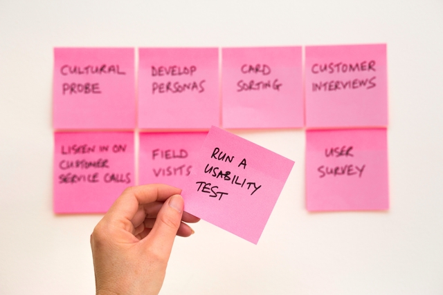

# **angmun.github.io**
Angelica Kamene Munyao's portfolio (a WIP)

## Inspiration
As a space to present projects and tidbits of ideas, having a board-like theme for the website seemed to be appropriate. This site is to serve as a continuously growing collection of heres and theres.

Photo by <a href="https://unsplash.com/@dtravisphd?utm_source=unsplash&amp;utm_medium=referral&amp;utm_content=creditCopyText">David Travis</a> on <a href="https://unsplash.com/?utm_source=unsplash&amp;utm_medium=referral&amp;utm_content=creditCopyText">Unsplash</a>

At the moment, the website utilizes HTML and CSS (projects themselves include some JavaScript), with some applicaton of the [BEM methodology](https://en.bem.info/methodology/css/) for CSS classes, albeit imperfect. Regardless, it has proven most useful in creating the various elements on my website board.

## TODOs
 - [ ] Include navigation for convenient access to site sections
 - [ ] Update projects to include skill tags and improve summaries
 - [ ] Improve upon existing projects
    - [ ] Jipoteze
    - [ ] You Can DIYit
    - [ ] Resume Website
 - [ ] Confirm accessibility and responsiveness
 - [ ] Plan for continued development of content